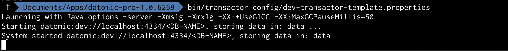
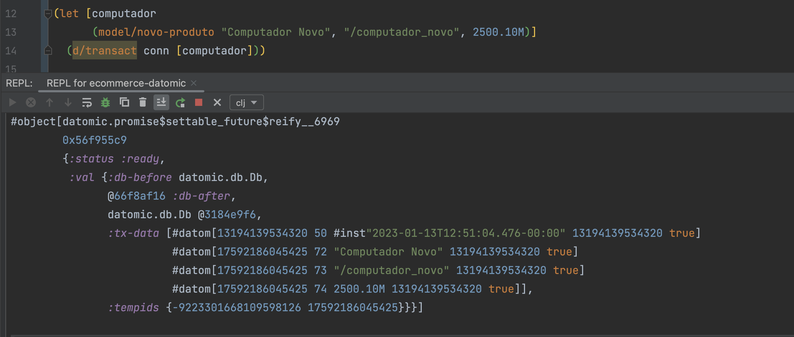
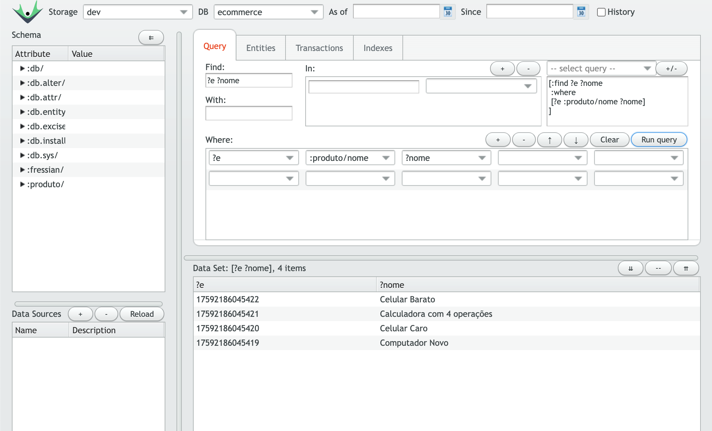

# Datomic Study

Aplicação clojure para estudo do banco de dados Datomic, em acompanhamento da formação Datomic da plataforma Alura.
O formato de negócio é ecommerce.

### Developer
[Kamila Serpa](https://kamilaserpa.github.io)

[1]: https://www.linkedin.com/in/kamila-serpa/
[2]: https://gitlab.com/java-kamila
[3]: https://github.com/kamilaserpa

[][1]
[][2]
[][3]

## Curso 1 - Datomic: um banco cronológico

### 1.1 Instalação

#### Servidor

O download da versão Starter pode ser feito em https://www.datomic.com/get-datomic.html, uma conta deve ser criada. A versão aqui utilizada foi `datomic-pro-1.0.6269`, pois as mais atuais não foram compatíveis.

Ao realizar o download recebemos a licença por e-mail, devemos inserir a licença no arquivo `config/samples/dev-transactor-template.properties`.
Após inserir a licença deve-se salvar o arquivo e copiá-lo na pasta `datomic-pro-x.x.xxx/config`.

É necessário o maven para instalação. Exporte a variável maven com:
> export PATH=$PATH:/Users/kamila.serpa/Documents/Apps/apache-maven-3.8.6/bin

Para instalar execute o comando `bin/maven-install` na pasta do Datomic. Para verificar a versão instalada execute o comando `cd ~/.m2/repository/com/datomic/dev-local/`, `ls` para listar as pastas, deve estar presente a pasta com o nome da versão instalada.

Para **executar o servidor Datomic** acesse o terminal na pasta do Datomic (`<local-path>/datomic-pro-1.0.6269`) e execute `bin transactor <LOCAL/NOME-DO-ARQUIVO.properties>`, por exemplo:

 > bin/transactor config/dev-transactor-template.properties

Espera-se que seja exibida a porta em que o banco de dados servidor está sendo executado:


#### Conexão com servidor

##### Forma 1 (utilizada)

_Optamos por esta maneira neste projeto!_
Para usar Datomic API e criar um banco de dados vamos utilizar o leiningen conforme a [documentação](https://docs.datomic.com/on-prem/peer/integrating-peer-lib.html#leiningen).

Adicione a dependência no arquivo `project.clj :dependencies` (entre aspas insira a versão utilizada no passo anterior):
 > [com.datomic/datomic-pro "1.0.6269"]

A biblioteca não é disponibilizada de forma aberta, então deve-se acessar a página https://my.datomic.com/downloads/pro. Estando logado no site, clique em _My account_ e veja ao final como baixar via leiningen.
Crie o arquivo `credentials.clj.gpg` e o adicione no diretório local `.lein` com o conteúdo no formato:

 > {#"my\.datomic\.com" {:username " ************ " 
 >                       :password " ************ "}}
 
##### Forma 2

Acesse https://www.datomic.com/ e clique em `dev-local`, em seguida clique em "how to get and configure dev-local" e "get the latest version of dev-tools", dessa maneira será enviado por e-mail o link para download.

Após realizado o download, descompacte o arquivo, acesse o terminal dentro da pasta (cognitect-dev-tools-0.9.72) e execute o comando `./install`.

Necessário o maven para instalação. Exporte a variável maven:
> export PATH=$PATH:/Users/kamila.serpa/Documents/Apps/apache-maven-3.8.6/bin
 
Para verificar a versão instalada execute o comando `cd ~/.m2/repository/com/datomic/dev-local/`, `ls` para listar as pastas.

Adicione essa versão no project.clj, segundo a [documentação](https://docs.datomic.com/on-prem/peer/integrating-peer-lib.html#leiningen):
 > [com.datomic/dev-local "1.0.243"]

#### Testando instalação
Vamos rodar nosso project.clj no REPL. 
Vamos rodar esse código que vai requerer a biblioteca datomic. Em seguida definimos um símbolo com os dados da conexão localhost na porta 4334 em um banco de dados chamado "hello" e criamos o banco de dados através do comando `d/create-database` passando o símbolo `db-url`. Esses comandos podem ser executados no REPL.

```clojure
  (require '[datomic.api :as d])
  (def db-url "datomic:dev://localhost:4334/hello")
  (d/create-database db-url)
```

Será devolvido true, temos um banco de dados criado. Se tentarmos de novo criar esse banco, devolve false porque ele já existe.

### 1.3 Schema e transações

No Datomic, não vamos pensar em várias tabelas, mas sim uma grande tabela. Nela, por exemplo, para o produto cujo ID é 15, o nome será Computador Novo, o slug será /computador_novo, e preco de 31500.10.

Assim estaremos atribuindo ao ID da entidade id_entidade, e teremos o atributo (slug) e o valor. Como podemos ter várias entidades adicionamos o namespace (:produto) para diferenciar sua propriedades. O id da entidade corresponde ao atributo pré-definido `:db/ident` no Datomic.

```clojure
; id_entidade atributo valor
; 15      :produto/nome Computador Novo
; 15      :produto/slug /computador_novo
; 15      :produto/preço 3500.10
```

Ao definir um schema para ser persistido no Datomic, indicamos o identificador (ident), o tipo de valor (valueType) e, no nosso caso, cardinalidade 1, já que um produto tem um nome.

```clojure
(def schema [{:db/ident :produto/nome
              :db/valueType :db.type/string 
              :db/cardinality :db.cardinality/one
              :db/doc "O nome de um produto"}]) 
```

Executamos o REPL, nREPL with Leiningen e carregamos o arquivo e.core com `Cmd + Shift + L`, para executar o conteúdo do arquivo.
Podemos utilizar também `Cmd + Shift + P` sobre uma função para forçar a sua execução no REPL e transacionar esse objeto.

Ao transacionar o Schema com `(d/transact conn db/schema)` obtemos:
```clojure
; #datom [id-da-entidade atributo valor id-da-tx added?]
#datom [72 10 :produto/nome 13194139534312 true]
#datom [72 40 23 13194139534312 true]
#datom [72 41 35 13194139534312 true]
#datom [72 62 "O nome de um produto" 13194139534312 true]
#datom [73 10 :produto/slug 13194139534312 true]
#datom [73 40 23 13194139534312 true]
#datom [73 41 35 13194139534312 true] 
#datom [73 62 "O caminho para acessar esse produto via http 13194139534312 true]
```

Onde:
> #datom [id-da-entidade atributo valor id-da-tx added?]

Podemos observar que:
 - :db/ident é 10
 - :db/valueType é 40 e :db.type/string é 23
 - :db/cardinality é 41 e :db.cardinality/one é 35
 - :db/doc é 62

Os tipos de valores possíveis (valueType) podem ser encontrados na doc [Schema | Datomic](https://docs.datomic.com/on-prem/schema/schema.html) e [Schema Data Reference](https://docs.datomic.com/cloud/schema/schema-reference.html).

O `transact` recebe a conexão e uma sequência, no nosso caso, um vetor com um único item.
O bollean `true` indica que é uma inserção de valor.

#### INSERT

Para **inserir** um dado utilizamos a função `d/transact` passando a [conexão](https://docs.datomic.com/on-prem/getting-started/connect-to-a-database.html#connecting).
 > (d/transact conn [data])



 Observamos que o quarto valor no banco indica o ID da transação "13194139534320", um valor que o Datomic gera para a entidade "1759...5425" e para cada atributo. Ou seja, para a entidade `...5425` o `72` tem valor "Computador Novo".

Além disso o booleano ao final indica se houve inclusão `true`, ou retirada `false` de dados.
Por padrão o Datomic aceita chaves sem valor, vazias. Já se tentar inserir um atributo com valor `nil` obtemos um erro. Portanto devemos apenas não enviar uma chave caso ela esteja vazia.

## 2. Retract, updates e organização

### 2.1 Delete só no log e update com insert

Ao executar uma inserção `@(d/transact conn [(model/novo-produto "Celular barato" "/celular-barato" 350.0M)]` é retornado um [future](https://clojuredocs.org/clojure.core/future), desse modo recebemos uma `promisse`, como mostrado abaixo.

```clojure
#<promise$settable_future$reify__6969@7faacb17: 
  {:db-before datomic.db.Db@122e1a04,
   :db-after datomic.db.Db@3fd3033c,
   :tx-data
   [#datom[13194139534344 50 #inst "2023-01-18T22:24:34.928-00:00" 13194139534344 true] #datom[17592186045449 72 "Celular barato" 13194139534344 true] #datom[17592186045449 73 "/celular-barato" 13194139534344 true] #datom[17592186045449 74 350.0M 13194139534344 true]],
   :tempids {-9223301668109598136 17592186045449}}>
=> nil
```

Utilizamos `deref/@` para aguardar e receber o valor da `future`. Em instantes seguintes o sucesso possui as propriedades `:status ready` e `:val` com os dados transacionados.

#### Algumas operações

 - FIND

Captura o id das entidades e o valor do atributo ":produto/nome" persistidas.
```clojure
(d/q '[:find ?entidade ?nome
       :where [?entidade :produto/nome ?nome]] db)
```

 - UPDATE

Atualiza o ":produto/preco" da entidade celular com id-entidade passado como parâmetro: </br>
`@(d/transact conn [[:db/add id-entidade-celular :produto/preco 0.1M]])`.

Obseve que foi adicionado um `true` com valor 0.1M e um false no valor anterior 350.0M.

```clojure
{:db-before datomic.db.Db@5f85640,
 :db-after datomic.db.Db@5db24ccb,
 :tx-data
 [#datom[13194139534495 50 #inst "2024-04-02T21:47:50.679-00:00" 13194139534495 true] #datom[17592186045598 74 0.1M 13194139534495 true] #datom[17592186045598 74 350.0M 13194139534495 false]],
 :tempids {}}
```

"Remove" o atributo ":produto/slug" com valor "/celular-barato" da entidade com o id passado como parâmetro. Lembrando: remover um item não significa que ele removeu de verdade, significa apenas que ele tem um log falando a partir desse instante da historia do banco, esse valor não deve estar mais lá: 
</br>
`@(d/transact conn [[:db/retract id-entidade :produto/slug "/celular-barato"]])`

#### Atomicidade
Ao tentarmos transacionar os quatro produtos abaixo ao mesmo tempo, obteremos um erro em "celular-barato" pois está com preço nulo.
```clojure
(let [computador (model/novo-produto "Computador Novo", "/computador_novo", 2500.10M) 
     celular (model/novo-produto "Celular Caro", "/celular", 888888.10M)
     calculadora {:produto/nome "Calculadora com 4 operações"}
     celular-barato (model/novo-produto "Celular Barato", "/celular-barato", nil)]
    (d/transact conn [computador celular calculadora celular-barato]))
```
Nesse caso a transação toda é cancelada e nhuma das entidades é persistida.

Essa característica transacional de fazer "ou tudo ou nada" é chamada de Atomicidade: se uma parte da transação falhar, a transação toda falha e nenhuma mudança é feita no BD.
Mais informações sobre outras características transacionais do Datomic em: https://docs.datomic.com/on-prem/acid.html

## 3. Mais queries

### Queries com parâmetros

Buscando todas as entidades com slug igual ao `slug-param` recebido pela função. Nesse caso precisamos passaar dois parâmetros para a cobnsulta, o db e o slug procurado. Portanto colocamos esses valores no `:in`. Para o banco de dados a nomenclatura padrão é um `$`(cifrão).
Dessa forma `?entidade`é um valor qualquer que será buscado, já `$`e `?slug` são variáveis de valor fixo "bindados" dentro da consulta.

```clojure
(defn todos-os-produtos-por-slug [db slug-param]
  (d/q '[:find  ?entidade
         :in    $ ?slug
         :where [?entidade :produto/slug ?slug]]
       db slug-param))
```

O Datomic trabalha com conjuntos portanto não vem em ordem predefinida, é possível ordenar após buscar os dados.

## 4. Pull

Para retornar os valores como mapas podemos usar `:keys`, a seguir retornamos as propriedades ?nome e ?preco como valores das keys `:produto/nome` e `:produto/preco`:

```clojure
(defn todos-os-produtos-por-preco [db]
 (d/q '[:find ?nome, ?preco
        :keys produto/nome, produto/preco
        :where [?produto :produto/preco ?preco]
               [?produto :produto/nome ?nome]]
      db))
```
Dessa forma retornará:

```
[#:produto{:nome "Celular Motorola", :preco 876.0M}
 #:produto{:nome "Calculadora Portátil", :preco 9.99M}
 #:produto{:nome "Computador Dell", :preco 3700.0M}
 #:produto{:nome "Celular Sansumg", :preco 1350.0M}]
```

 Podemos utilizar o pull explícito, no qual explicitamos os atributos que desejamos retornar para essa entidade:

```clojure
(defn todos-os-produtos [db]
    (d/q '[:find (pull ?etidade [:produto/nome :produto/preco :produto/slug])
        :where ?entidade :produto/nome]] db))
```

Ou o o pull implícito, no qual retornamos todos os atributos dessa entidade:

```clojure
(defn todos-os-produtos [db]
    (d/q '[:find (pull ?etidade [*]) ; <-
        :where ?entidade :produto/nome]] db))
```
Que retornará algo como:
```
[[{:db/id 17592186045640,
   :produto/nome "Calculadora Portátil",
   :produto/slug "/calculadora-portatil",
   :produto/preco 9.99M}]
 [...]]
```

## 5. Bancos filtrados e histórico
Uma das grandes capacidades do Datomic é permitir o armazenamento dos eventos que ocorrerem e nos permitir voltar para o passado, acessando todo o histórico.
Podemos solicitar a situação do banco em um momento específico através do [asOf Filter](https://docs.datomic.com/pro/time/filters.html#as-of): (d/as-of conn ???)), sendo que "???" será o momento que passaremos em que o banco estava e queremos executar a query.

```clojure
  (db/todos-os-produtos (d/as-of (d/db conn) #inst "2024-04-03T17:45:26.512-00:00"))
  ; outra possibilidade e definir um snapshot de um momento anterior do banco
  (def fotografia-no-passado (d/db conn))
  (db/todos-os-produtos fotografia-no-passado)
```

## 6. Otimizações e cardinalidade

Numa query podemos usar funções. Mas devemos ter cuidado, pois o código sempre executará na ordem. Então, existe uma questão de otimização que em bancos SQL em geral são decisões tomadas pelo próprio banco de acordo com os índices, chamadas plano de ação. Ele olha a query que fizemos e o próprio banco decide quais serão os wheres e joins a ser feitos e em qual ordem, esperando minimizar o impacto no algoritmo de filtragem, para que ele execute o mais rápido o possível, passando pelo mínimo de elementos.

No Datomic tanto o banco quanto nós planejaremos índices, porém os planos de ação serão definidos pela consulta. Dessa forma é mais interessante primeiro filtrar os preções dos produtos para então capturar os atributos nomes.

```clojure
(defn todos-os-produtos-por-preco [db preco-minimo-requisitado]
   (d/q '[:find ?nome, ?preco
          :in $, ?preco-minimo
          :keys produto/nome, produto/preco
          :where [?produto :produto/preco ?preco]
                 [(> ?produto ?preco-minimo)]  
                 [(?produto :produto/nome ?nome)]
                db preco-minimo-requisitado))
```

### Cardinalidade

Adicionamos na entidade produto o atributo `:produto/palavra-chave` com a cardinalidade `:db.cardinality/many`.
```clojure
{:db/ident       :produto/palavra-chave
 :db/valueType   :db.type/string
 :db/cardinality :db.cardinality/many
 :db/doc         "Palavras-chave com características do produto"}
```
Podemos inserir valor para esse atributo com `:db/add`:
> (d/transact ecommerce.core/conn [[:db/add (:db/id produto-computador-acer) :produto/palavra-chave "computador"]]))`

Exemplo de entidade com o vetor de strings:
```clojure
  {:db/id 17592186045420,
   :produto/nome "Computador Acer",
   :produto/slug "/computador-acer",
   :produto/preco 2700.0M,
   :produto/palavra-chave ["computador" "desktop"]}
```

Também podemos remover uma palavra-chave com `:db/retract`:
> (d/transact ecommerce.core/conn [[:db/retract (:db/id produto-tv-philips) :produto/palavra-chave "smart"]]))

A query de busca por palavra-chave fica semelhante ao já mencionado anteriormente:
```clojure
(defn produtos-por-palavra-chave
  [db palavra-chave-param]
  (d/q '[:find (pull ?produto [*])
         :in $, ?palavra-chave
         :where [?produto :produto/palavra-chave ?palavra-chave]]
       db palavra-chave-param))
```

## Curso 2 - Datomic Queries: avançando com o modelo e pesquisas

É possível visualizar os dados do banco através do navegador com o [Datomic Console](https://docs.datomic.com/pro/other-tools/console.html). 
Na pasta daotmic/bin executamos o comando abaixo:
> bin/console -p 8080 dev datomic:dev://localhost:4334/

Então podemos acesar o banco no navegador pelo link http://localhost:8080/browse.




